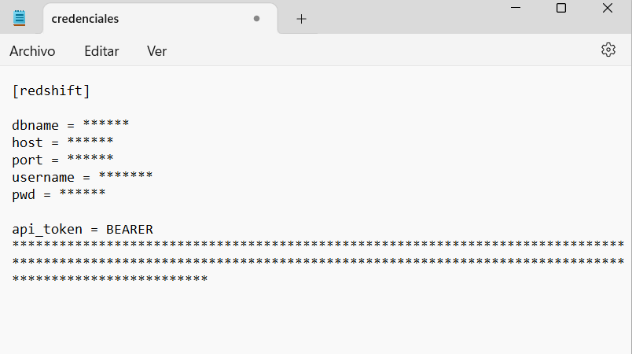
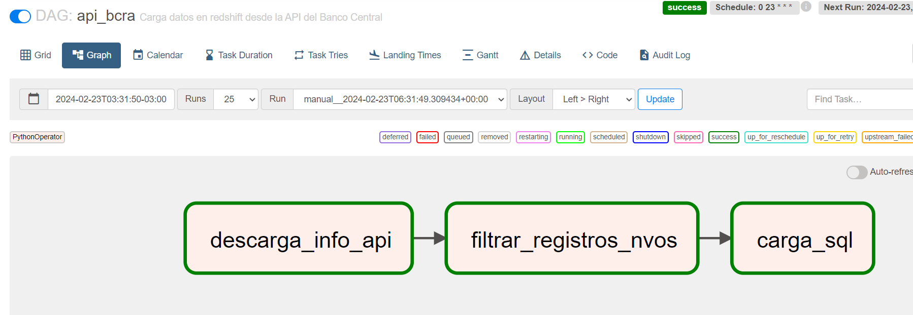

# Proyecto final - Data Engineering. Curso Coderhouse

### Desarrollado por Mauro Rodríguez

## Requerimientos

- Tener instalado Docker Desktop

## Descripción

El siguiente script de Python nos permite ejecutar un DAG en Apache-Airflow, el cual nos permite descargar desde la API del Banco Central de la República Argentina (BCRA), información diaria referida a diversas variables monetarias de dicho país.

Concretamente, las tareas que realiza el DAG son las siguientes:

- Realiza una descarga de datos diarios de la API del BCRA.

- Produce una limpieza de los datos y establece si existen registros nuevos que no fueron cargados aún. Nos devuelve un mensaje en los logs informando esto.

- Almacena los nuevos datos, si los hay, en una tabla de una base de datos Amazon Redshift.

Si bien es un ejemplo simple del funcionamiento de un proceso de ETL (extract, transform, load), las facilidades que brinda Apache-Airflow permiten que tengamos la posibilidad de ir escalando y complejizando facilmente las tareas de forma horizontal. 

## Archivos y carpetas necesarios para correr Airflow en Docker.

Para correr nuestro DAG en Airflow, utilizaremos un archivo .yaml de Docker Compose, el cual nos permite correr varios contenedores con múltiples servicios en simultáneo y de forma articulada. Para correr estos contenedores, necesitamos alojar en una carpeta de nuestra computadora los siguientes archivos y crear las carpetas que se mencionan a continuación:

- Archivo docker-compose.yaml (descargarlo de este repositorio)

- Carpeta dags/

- Carpeta logs/

- Carpeta plugins/

- Carpeta data/

- Carpeta credenciales/

Dentro de la **carpeta dags** debe almacenarse el script de Python **dag_bcra.py**, el cual debe ser descargardo de este repositorio.

En segundo lugar, debemos descargar y llenar el archivo **credenciales.ini**. Este archivo cuenta con la estructura necesaria para almacenar las credenciales, tanto de nuestra base de datos y el token de la API. Una vez que completamos los datos en este archivo, debemos alojarlo en la carpeta carpeta **credenciales**, previamente creada.

## Uso de credenciales.

La estructura del archivo credenciales.ini es la siguiente:

- dbname: hace referencia al nombre de la base de datos.

- host: se refiere al nombre del servidor de Amazon Redshift.

- port: es el puerto.

- username: es el nombre de usuario.

- pwd: refiere a la contraseña.

Finalmente, tenemos la clave api_token=, la cual debemos obtenerla en la siguiente dirección web: https://estadisticasbcra.com/api/registracion

Solo debemos registrar nuestro e-mail y la página nos devolverá el token que debemos copiar y pegar en nuestro archivo credenciales.ini. Este token permite hasta 100 consultas diarias y pasado el año debe ser renovado por otro token. La misma página informa cuando expira el mismo.

## Crear tabla en Amazon Redshift

Antes de correr nuestro DAG de Airflow en un contenedor de Docker, debemos crear la tabla necesaria para el almacenamiendo de los datos en Amazon Redshift. Hemos subido al repositorio el archivo **tabla_redshift.sql**, el cual contiene el código SQL necesario para crear dicha tabla.

## Modo de uso

El modo de uso debe seguir los siguientes pasos:

1. Debemos correr el archivo docker-compose (correr el comando "docker compose up" en nuestra consola, una vez que nos posamos en la carpeta que contiene nuestros archivos).
2. Ingrese en nuestro navegador web "localhost:8080", que es donde se correrá el webserver de Airflow.
3. Ingrese "airflow" como usuario y como contraseña (ambas).
4. Una vez dentro, debe activarse el DAG y luego podremos visualizar si las tareas corren correctamente.

