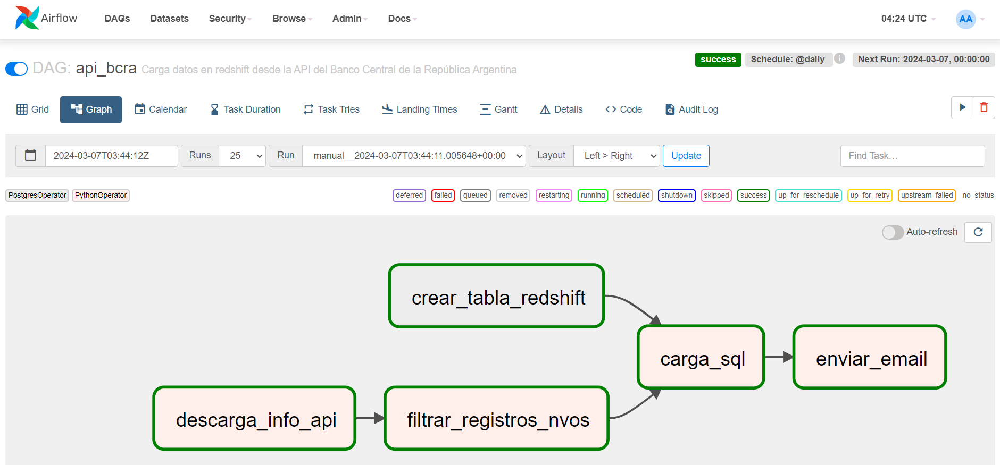

# Proyecto final - Data Engineering. Curso Coderhouse

### Desarrollado por Mauro Rodríguez

## Requerimientos

- Tener instalado Docker Desktop

- Tener una cuenta de Amazon redshift

## Descripción

El siguiente script de Python nos permite ejecutar un DAG en Apache-Airflow, el cual ejecuta una descarga de datos diarios desde la API del Banco Central de la República Argentina (BCRA) referida a diversas variables monetarias de dicho país.

Concretamente, las tareas que realiza el DAG son las siguientes:

- Realiza una descarga de datos diarios de la API del BCRA.

- Produce una limpieza de los datos y filtra los registros nuevos que no fueron cargados aún. 

- Comprueba que exista la tabla específica en Amazon Redshift. En caso de no existir la crea.

- Almacena los nuevos datos, si los hay, en la tabla de la base de datos Amazon Redshift.

- Envía un e-mail a nuestro correo notificandonos los resultados de la carga.

Si bien es un ejemplo simple del funcionamiento de un proceso de ETL (extract, transform, load), las facilidades que brinda Apache-Airflow nos permiten ir escalando y complejizando facilmente las tareas de forma horizontal. 

## Archivos y carpetas necesarios para correr Airflow en Docker.

Para correr nuestro DAG en Airflow, utilizaremos un archivo .yaml de Docker Compose, el cual nos permite correr varios contenedores con múltiples servicios en simultáneo y de forma articulada. Para correr estos contenedores, necesitamos alojar en una carpeta de nuestra computadora local el archivo .yaml:

- Archivo docker-compose.yaml (descargarlo de este repositorio)

Y crear en el mismo directorio las siguientes carpetas:

- /dags

- /logs

- /plugins

- /data

Dentro de la **carpeta dags** debe almacenarse los scripts de Python **dag_bcra.py**, **funciones.py** y el script sql **tabla_redshift.sql**, los cuales deben ser descargardos de este repositorio.

Hay que tener en cuenta de que el archivo tabla_redshift.sql debe ser modificado previamente para indicarle el nombre del schema en donde se almacenará la tabla. Para ello, debemos cambiar el nombre "[schema]" que viene por defecto, por el que corresponda. Es importante no modificar solo el nombre del schema y no de la tabla. 

## Modo de uso

El modo de uso debe seguir los siguientes pasos:

1. Debemos correr el archivo docker-compose (correr el comando "docker compose up" en nuestra consola, una vez que nos hayamos posado en la carpeta que contiene nuestros archivos).
2. Ingrese en nuestro navegador web "localhost:8080", que es donde se correrá el webserver de Airflow.
3. Ingrese "airflow" como usuario y como contraseña (ambas).
4. Cargue las credenciales correspondientes dentro del webserver (ver la próxima sección).
5. Una vez dentro, debe activarse el DAG y luego podremos visualizar si las tareas corren correctamente.

## Uso de credenciales.

Antes de poder correr nuestro DAG correctamente, primero debemos cargar nuestras credenciales que incluyen nuestro usuario de Amazon Redshift, el token de la API del BCRA y los e-mail que utilizaremos para notificar los resultados de las tareas ejecutadas.

### Conexión a Amazon Redshift

Para conectarnos a nuestra cuenta de Amazon Redshift, primero debemos abrir el webserver de Airflow en el puerto 8080, como hemos mencionado previamente. Luego debemos dirigirnos a:

- la solapa Admin >> Connections

En esta sección tenemos que agregar los datos de la conexión de redshift dentro de un conector Postgres y usando el nombre del identificador (en la sección "connection Id")  "conn_redshift".

A estos datos pre-establecidos hay que sumarles:

- Host: se refiere al nombre del servidor de Amazon Redshift.

- Schema: debemos introducir el nombre de la base de datos.

- Login: es el nombre de usuario.

- Password: refiere a la contraseña.

- Port: es el puerto.

Una vez finalizada la carga, podemos testear y guardar la conexión.

### Token de la API y datos correo electrónico

Estas credenciales también debemos introducirlas en el webserver pero en la sección de variables. Para ello seleccionamos:

- Solapa Admin >> Variables

A cada variable que creemos tenemos que asignarle una clave de identificación en "Key" y la credencial correspondiente en "Val".

Las 4 variables que debemos crear son:

- "api_token" (token de la API)

- "from" (gmail desde donde se envíará el mensaje)

- "password" (contraseña de aplicaciones de nuestra cuenta de gmail)

- "to" (e-mail destinatario de nuestro mensaje)

El token de la API debemos obtenerlo en la siguiente dirección web: https://estadisticasbcra.com/api/registracion. Solo debemos registrar nuestro e-mail y la página nos devolverá el token que debemos copiar y pegar al crear la variable "api_token". Este token permite hasta 100 consultas diarias y pasado el año debe ser renovado por otro token. La misma página informa cuando expira el mismo.

En tanto, para obtener la contraseña de aplicaciones debemos ingresar a nuestra cuenta de gmail y seguir los siguientes pasos:

Gestionar tu cuenta de Google >> Seguridad >> Verificación en dos pasos >> Ingresamos la contraseña de nuestro gmail >> Contraseñas de aplicación

Allí podremos crear una nueva contraseña y eliminarla cuando ya no nos sirva. El código que nos devuelve gmail debemos ingresarlo en la variable cuya clave debe ser "password".
